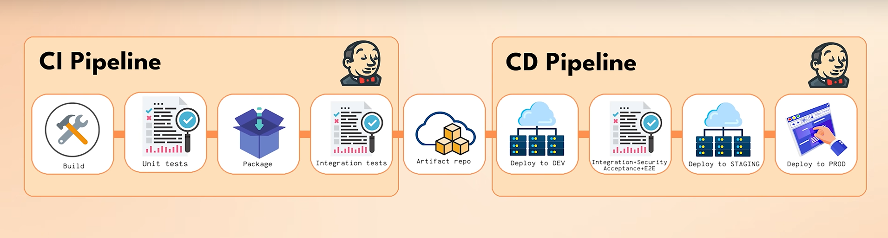

# ⚙️ **Before CI/CD — Il Problema**

---

## 📌 **1️⃣ Scenario: la realtà senza CI/CD**

Immagina:

* Tu e il tuo team sviluppate un’app 📱.
* ✅ **Prima versione pronta** → tempo di fare il **deploy**.

---

## 🔗 **2️⃣ I problemi iniziano subito**

* 🔀 Fai **merge** nel branch `main` → **conflitti** perché altri hanno modificato codice.
* 🛠️ Risolvi i conflitti a mano.
* 📑 Merge completato? Partono i test (es. Jenkins).
* ❌ Emergono bug → Tutti corrono a fixare → Ancora merge, fix, patch.

---

## 🏃 **3️⃣ Code Freeze & Testing manuale**

* Fine sprint? **Code Freeze** 🚫:

  * Nessuno mergea altro.

* Si testa a mano:

  * Funziona tutto?
  * Nuove feature OK?
  * Non si sono rotti moduli vecchi?

* ⚡ Trovi bug → Fix di corsa → Ritest.

---

## ⚙️ **4️⃣ Deploy = Processo manuale**

1️⃣ Checkout `main`.
2️⃣ Bump versione, push su Git.
3️⃣ Jenkins:

* Lancia test.
* Build Docker image.
* Push al registry.

4️⃣ 🔧 Aggiorna **a mano**:

* `docker-compose.yml`
* Manifest Kubernetes
* File YAML per nuovi servizi.

5️⃣ Un membro **senior**:

* `kubectl apply` su cluster.
* Oppure `ssh` → stop container → restart con Docker Compose.

6️⃣ 🔗 Passa URL ai tester:

* “Testate! Poi vi preparo il deploy in produzione.”

---

## 🕹️ **5️⃣ Deploy in produzione = Stress 😰**

* Stesso flow, **ma peggio**:

  * Più test.
  * Più ansia.
  * Più rischi.

⚠️ **Mai deploy venerdì sera!**

* Se l’app va giù → Niente team overnight.
* Utenti bloccati → Disastro reputazionale.

---

## 🧩 **6️⃣ Problema radice**

**Tutto è manuale → Dipende dall’umano.**
Risultato:

* 🚫 Rallenta il ciclo di rilascio.
* 🔄 Altamente soggetto a errori.
* 🧱 Tante inefficienze.
* 😬 Stress, ansia e rischio bug in produzione.

---

## 🎯 **7️⃣ Punto chiave**

👉 **Senza CI/CD**:

* L’intero flusso (build → test → deploy) è **umano e fragile**.
* CI/CD automatizza:

  * Merge sicuri.
  * Test continui.
  * Deploy automatici, ripetibili, sicuri.

---

## ✅ **8️⃣ E ora?**

✨ **Domanda:**
Come trasformiamo questo incubo manuale in una **pipeline CI/CD fluida**?
💡 **Risposta:** Ottimizziamo **ogni parte** → **Passo per passo** → E costruiamo la pipeline da sogno di ogni dev team 🚀
