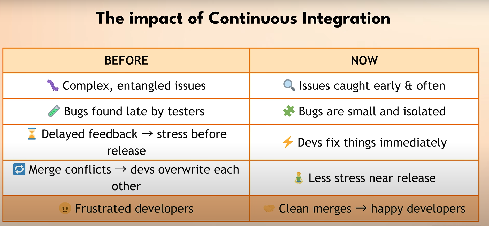

# 🔄 **Continuous Integration (CI Pipeline)**

---

## 📌 **1️⃣ Il problema di partenza**

👉 Senza **CI**, succede spesso che:

* Si fanno merge di **grandi branch** ➡️ **Tanti conflitti**.
* I test girano **solo dopo** il merge ➡️ Troppo tardi.
* I bug emergono **a fine sprint** ➡️ Correzioni stressanti, merge intricati.

---

## ⚙️ **2️⃣ Soluzione: sposta i test prima!**

💡 **Idea chiave**:

* **Non aspettare** di fare merge per testare!
* Esegui i test **direttamente sul branch di feature** PRIMA del merge.

✨ Vantaggio:

* Trovi bug **localizzati** per branch.
* Gli sviluppatori **fixano subito**, senza conflitti incrociati.

---

## ⏱️ **3️⃣ Ancora meglio: test ad ogni commit**

🚀 Non aspettare la pull request:

* Esegui test **su ogni commit** nel branch.
* Spingi gli sviluppatori a **fare commit/push frequenti** ➡️ Cambiamenti **più piccoli**, più facili da isolare.

✅ Risultato:

* Bug individuati **subito**.
* Niente mega push finali ➡️ Meno conflitti, meno caos.

---

## 🔑 **4️⃣ Cos’è CI**

**Continuous Integration (CI)** significa:

* 📦 Integrazione continua di **piccoli pezzi di codice**.
* 🔁 Merge **frequenti** nel branch principale.
* ✅ Verifica automatica (build + test) a **ogni commit**.

---

## 🎯 **5️⃣ Impatto pratico**

Grazie al **CI Pipeline**:

* ⚡ I bug vengono scoperti **subito**, non a fine sprint.
* 🔍 I problemi sono **più semplici**, localizzati, facili da risolvere.
* 🤝 Meno stress, meno conflitti.
* 👩‍💻 Gli sviluppatori non si pestano i piedi a vicenda.

---

## 🤖 **6️⃣ Automazione extra: Code Rabbit**

✨ Esempio di strumento:

* **Code Rabbit** ➡️ AI per **code review automatica**.

  * 🔍 Analizza pull request.
  * 🐞 Trova bug, vulnerabilità, problemi di performance.
  * 📑 Fa **root cause analysis** subito nella PR.

✅ Vantaggi:

* Non sostituisce i revisori umani.
* 🧹 Sgrava dalle cose banali ➡️ I revisori si concentrano su **design & architettura**.

---

## ⚡ **7️⃣ Principio CI/CD**

Il **filo conduttore**:

* 🐞 Trova i problemi **subito**.
* 🔄 Integra **frequentemente**.
* 🚀 Mantieni il flusso di sviluppo **scorrevole** e stabile.

---

## 🎁 **8️⃣ Bonus**

👉 Code Rabbit offre **1 mese gratuito** usando il codice `TECHWITHNANA`.

---

## ✅ **9️⃣ Prossimo step**

✨ Risolto il problema dei test tardivi ➡️ Ora vediamo come **automatizzare il deploy**!

