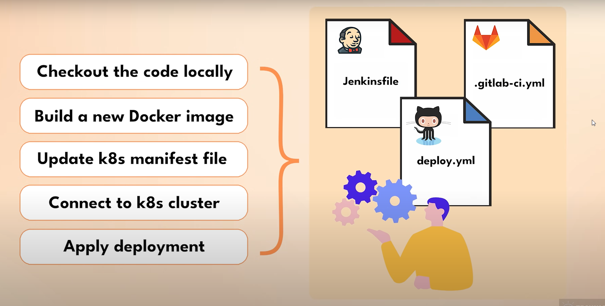
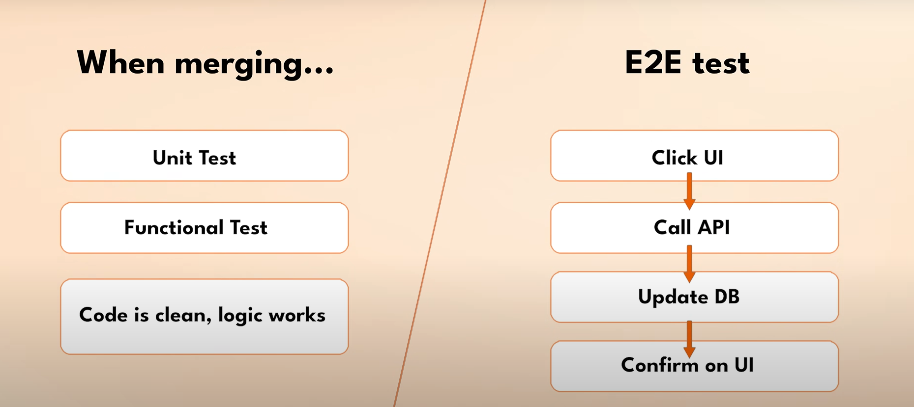
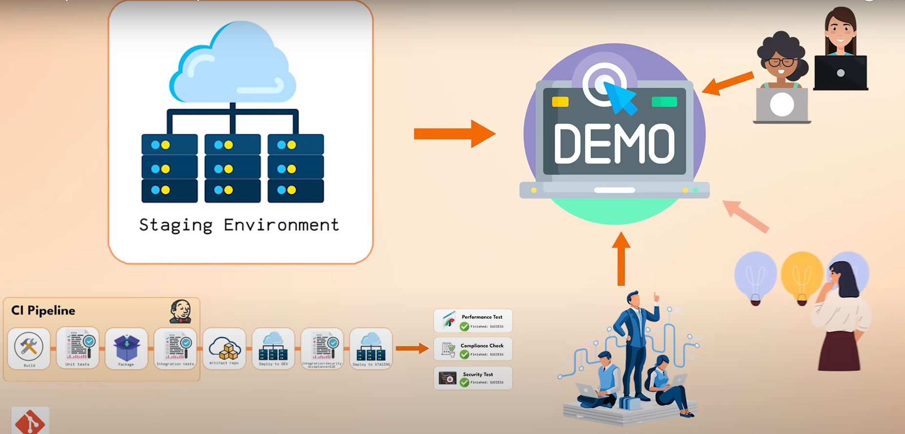
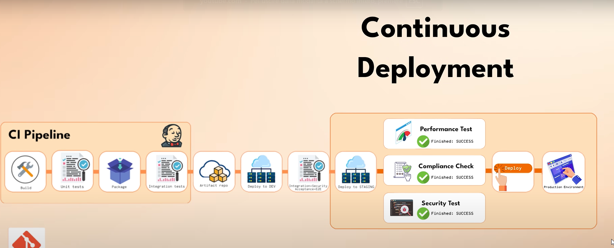
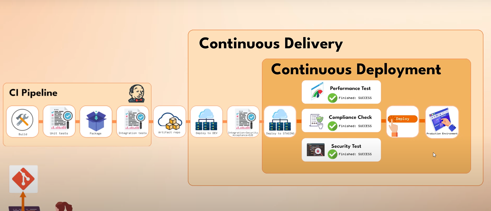

# 🚀 **Continuous Delivery (CD Pipeline)**

---

## 📌 **1️⃣ Il problema da risolvere**

Senza **CD**:

* ❌ Serve un **code freeze** per testare.
* 👨‍💻 Gli sviluppatori devono:

  * Fare checkout locale.
  * Costruire l’immagine Docker a mano.
  * Fare `ssh` sul server.
  * Aggiornare file `docker-compose.yml` o manifest Kubernetes a mano.
  * Eseguire `kubectl apply` o riavviare container manualmente.
* 🧑‍💻 Solo chi è **senior** sa farlo → colli di bottiglia.
* 😬 Il tutto è **manuale, lento e soggetto a errori**.

---

## ✨ **2️⃣ La parola magica: Automazione**

👉 Con **Continuous Delivery** automatizziamo TUTTO:

1️⃣ Se i **test CI** sono ✅:

* Costruiamo l’app in un’immagine Docker.
* Le diamo un **version tag**.
* Facciamo `push` al **Docker Registry**.

2️⃣ Dal sistema di build (es. Jenkins, GitLab CI, GitHub Actions):

* Connettiamo al server o cluster.
* Eseguiamo il **deploy automatico**:

  * Nuovo Pod/container.
  * Applichiamo aggiornamenti manifest YAML.
  * Eseguiamo `kubectl apply`.

---

## 🧰 **3️⃣ Il flusso CD in pratica**


* Si gestisce tutto con il tool di automazione della build (es. Jenkinsfile, .gitlab-ci.yml)

* Tutta la logica di:

- Verificare il codice localmente (checkout locale)
- Creare una nuova versione della Docker Image
- Aggiornare il file di kubernetes deployment manifest con la nuova versione della Docker Image
- Connetersi al cluster kubernetes
- Applicare il deployment


* Tutta questa logica è **automatizzata** in uno script di un Jenkinsfile o in un .gitlab-ci.yml o in un file GitHub Actions. 



* Dunque i passaggi manuali ora sono automatizzati da un tool, un tool CI/CD, un tool creato appositamente per questo scopo di automatizzare il processo

✨ Esempio:

```yaml
if: tests == green
then:
  - build: Docker image
  - tag: vNext
  - push: Docker registry
  - deploy: dev cluster
```

🔗 Tutta la logica è in:

* `Jenkinsfile`
* `.gitlab-ci.yml`
* `.github/workflows/*.yml`

✅ Risultato:

* Niente terminali manuali.
* Niente SSH.
* Zero passaggi dimenticati.

---

## 🔑 **4️⃣ Quanto costa farlo?**

* Serve:

  * 📌 Configurare tali tools di automazione del processo (es. Jenkins).
  * Configurare i permessi su Jenkins per poter fare il deploy nell'ambiente di sviluppo e testare il workflow
  * 🔑 Gestire accessi sicuri.
  * 🧩 Scrivere pipeline step-by-step.

💡 Ma:

* È un **investimento unico**.
* Impostare l'intero processo (che automatizziamo) di:
    - connessione con il Docker Registry
    - connessione con il cluster
    - connessione con i server 
    - proteggere il tutto e deployare tutto automaticamente 
    Farlo Ci metti **2–3 giorni** se sai come farlo.
* 🏆 Risparmi **mesi** di deploy manuali.

---

## 📌 **5️⃣ Non è solo build: test E2E automatici**

* Cosa avviene dopo che abbiamo distribuito/deployato sull'ambiete di sviluppo? 

Dopo deploy su dev:

* **Facciamo test più estesi**:

  * Test end-to-end ➡️ Click su UI, verifica DB.
  * Test di integrazione con servizi esterni.
  * Test dinamici di sicurezza (es. tentativi SQL injection).

✨ Esempio:

```yaml
jobs:
  - deploy: dev
  - test: e2e + security scan
```

* Dobbiamo testare il deploy in un ambiente di esecuzione per accertarci che la connettività, la configurazione, l'impostazione, l'infrastruttura sottostante ecc. funzionino correttamente.

* Dobbiamo fare test più estensivi sul funzionamento vero e prorpio del deploy su ambiente dev.

* Quando facciamo merging durante CI pipeline testiamo il codice, la sintassi, e la funzionalità. Questi sono Unit test, test funzionali, vediamo che il codice è pulito e che la logica funziona

* Quì invece nella CD pipeline dopo aver fatto il deploy automatizzato su ambiente di sviluppo facciamo test sull'intero ambiente dall'inizio alla fine (E2E test):
    - Facciamo i vari click sull'interfaccia utente UI
    - Controlliamo che tutte le API funzionino 
    - Controlliamo che si facciano effettivamente gli aggiornamenti sul DB



* Il punto chiave è che non facciamo questi test manualmente ma automattiziamo anche questo.

* Scriviamo test automatizzati end-to-end e di intergrazione perchè vogliamo eliminare il più possibile l'intervento umano dal ciclo in ogni fase. Eseguiamo questi test automatizzati nella CD pipeline subito dopo il deployment 

* **Post-Deployment Pipeline checks**:
    - Verifichiamo che l'applicazione funzioni correttamente 
    - Facciamo test per verificare problemi di sicurezza che potrebbero compromettere i nostri sistemi
    
* In questa fase eseguiamo test molto approfonditi su un sistam in esecuzione

---

## ⚡ **6️⃣ Chi scrive questi test?**

* 🧩 Il team! Sì, serve tempo per scriverli.
* Ma i test girano:

  * **Ogni merge**.
  * **Ogni commit** se serve.
  * **Più volte a settimana** → Risparmio di test manuali enormi.

✅ Risultato:

* Meno bug.
* Meno sorprese in produzione.

---

## 🏗️ **7️⃣ Rilascio in fasi**

✨ Dopo `dev`:

* Deploy su ambiente `test` o `staging` (pre-produzione).
* Altra batteria di test.
* Se tutto verde ✅ → Pronti per `prod`.

Questo flusso **CI + CD**:

* Verifica **codice + ambiente**.
* Assicura che l’intera app funzioni prima di andare live.

* Dunque, rilasciamo le modifiche al condice in più fasi, in cui vengono testate a ogni stadio, e questo workflow di distribuzione di una versione fino all'ambiente di staging o di test è chiamoato CD (continuous delivery)

---

## 🎯 **8️⃣ Impatto reale**

Con **CD Pipeline**:

* 📦 Deploy **automatici**.
* 👨‍💻 Niente più code freeze.
* 🚫 Niente umani che fanno `ssh` la sera.
* 🧘 Nessuno in ansia prima del rilascio.
* 🏖️ Anche il senior può andare in ferie: la pipeline lavora per tutti.

---

## Produzione

* Ci rimane un'ultimo step da fare dato chei nostri utenti finali non hanno ancora visto le modifiche al nostro codice

* Stiamo andando verso la produzione con il nostro processo di ralascio completamente automatizzato perchè abbiamo gli strumenti per farlo.

* Cosa succede quindi dopo la messa in scena? Se stiamo sviluppando una'applicazion e rivolta ai clienti, e vogliamo rilasciare a loro una nuova funzionalità. Quindi ci chiediamo: cos'altro dobbiamo verificare per essere sicuri al 100% di non rovinare la nostra applicazione a vita?

* Eseguiamo test sulle Performance e ulteriori test sulla conformità e sicurezza, eseguiamo tutto sulli staging e convalidiamo che tutto sia a posto al 100%

##  🚀 **Continuous Deployment**

---

## 📌 **1️⃣ Non è ancora finita**

✅ Con **CI** e **CD**:

* Abbiamo validato il codice.
* Abbiamo deploy automatici su **Dev** e **Staging**.
* Ma… gli **utenti finali** 👥 non vedono ancora le novità!

---

## 🗂️ **2️⃣ Prossimo step: andare in produzione**

👉 Dopo lo **staging**, serve:

* Ultima validazione 🔍

  * ✅ Test di **performance**
  * ✅ Verifiche di **compliance**
  * ✅ Controlli di **sicurezza avanzati**
* Tutto sullo staging ➡️ Ambiente quasi identico alla produzione.

---

## ⚙️ **3️⃣ L’ultimo clic: Deploy in Prod**

✨ Di solito:

* Non sempre conviene fare **deploy 100% automatico** in produzione.
* ⚙️ Spesso c’è:

  * Una **demo** per il team/PM/sponsor.
  * Un **OK finale** del product owner o di un decision maker.



* Dunque è comune avere una conferma manuale subito prima del deployment in produzione

✅ Questo step è:

* Solo **un bottone** ➡️ `Deploy to Prod`.
* Il **flusso tecnico** è **sempre automatico**:

  * Il clic avvia script e pipeline.
  * Anche un non-tecnico può farlo in **GitHub Actions**, **GitLab**, **Jenkins**, ecc.

---

## 🔑 **4️⃣ Continuous Deployment**

**Definizione**:

* **Continuous Deployment (CD)** = Proseguimento naturale di **Continuous Delivery**.
* Significa che **ogni release testata** può essere **rilasciata in produzione**:

  * ✅ In automatico **oppure**
  * ✅ Con **approvazione manuale** (1 clic)



---

## 💡 **5️⃣ Vantaggi**

* ⏱️ Rilasci **rapidi** e frequenti.
* 🔄 Nessun blocco manuale (a parte l’ok finale se serve).
* 🧩 La pipeline si occupa di **tutto**:

  * Deploy
  * Configurazioni
  * Scaling, rolling updates, rollback se serve.

---

## 🧩 **6️⃣ Riassunto finale: CI/CD/CD**

| Fase                         | Obiettivo                                                |
| ---------------------------- | -------------------------------------------------------- |
| ✅ **Continuous Integration** | Integrazione e test continui del codice.                 |
| 🚀 **Continuous Delivery**   | Deploy automatici in Dev, Test, Staging.                 |
| 🌍 **Continuous Deployment** | Deploy automatico (o semi-automatico) in **Produzione**. |




---

## 🎯 **7️⃣ Impatto sul team**

Grazie a **Continuous Deployment**:

* 📌 **Nessun freeze**, nessuna finestra notturna.
* ✅ Qualità testata a più livelli.
* 🧘 Nessuno in ansia: l’app è **pronta e stabile**.
* 🔗 Deployment rapido, sicuro, ripetibile.

---

# 🚀 **Deployment Strategies**

---

## 🎯 **1️⃣ Il problema residuo**

Anche con:

* ✅ **CI:** Test continui sul codice.
* ✅ **CD:** Deploy automatici su dev, staging, prod.

👉 Resta **un rischio minimo**:

* 🧩 Un **bug nascosto** può **sfuggire** ai test.
* Anche con il 99% di confidenza ➡️ Rimane quell’**1% di incertezza**.

---

## ⚡ **2️⃣ Come ridurre ancora il rischio?**

✨ **Strategie di deploy intelligenti**:

* 🐦 **Canary Deployment**
* 🟦🟩 **Blue-Green Deployment**

---

## 🐦 **3️⃣ Canary Deployment**

**Idea chiave**:

* Rilasci la **nuova versione** solo a una piccola percentuale di utenti (es. 1%).
* 🔍 **Osservi**:

  * Tutto OK? Aumenti al 5%, poi 10%…
  * Progressivo ➡️ fino al 100%.

**Come funziona**:

* Il traffico è **splittato** tra:

  * Versione **corrente**.
  * Versione **nuova**.

👉 Se qualcosa va male ➡️ Blocchi l’espansione al traffico di utenti.

---

## 🟦🟩 **4️⃣ Blue-Green Deployment**

**Idea chiave**:

* Hai **2 ambienti identici**:

  * 🟦 **Blue** → Versione **attuale**.
  * 🟩 **Green** → Versione **nuova**.

**Come funziona**:

* Deploy nella **Green**.
* Se OK ➡️ Switchi **tutto il traffico** su Green.
* Problema? ➡️ Torni subito a Blue.

✅ **Rollback istantaneo**.

---

## 🗂️ **5️⃣ Setup richiesto**

Per entrambi serve:

* 📡 **Monitoraggio continuo** → Alert automatici.
* 🔗 Bilanciatore di carico o routing intelligente.
* 🚦 Strategie di fallback integrate.

💡 Una volta configurato ➡️ Risparmi stress e rischi ogni volta.

---

## 🔑 **6️⃣ Impatto strategico**

✨ Queste strategie:

* 🔒 Riduci al minimo il rischio di bug in produzione.
* 🧘‍♂️ Dai **tranquillità** al team.
* 🚀 Aumenti la **frequenza di deploy**:

  * Meno paura → Più rilasci → Maggiore velocità di business.

---

## 🧩 **7️⃣ CI/CD come spina dorsale del DevOps**

Tutto questo fa parte del **core DevOps**:

* **CI/CD = Automazione end-to-end**:

  * Codice ➡️ Test ➡️ Build ➡️ Deploy ➡️ Monitoraggio ➡️ Rollback ➡️ Repeat.

👉 Elimina lavoro manuale.
👉 Aumenta la velocità e la qualità.
👉 Permette **deploy frequenti e sicuri**.

---

## ✅ **8️⃣ Riassunto**

| Strategia           | Come funziona                              | Vantaggio                                |
| ------------------- | ------------------------------------------ | ---------------------------------------- |
| 🐦 **Canary**       | Rilascio graduale a sottoinsiemi di utenti | Rischio controllato, rollout progressivo |
| 🟦🟩 **Blue-Green** | Due ambienti identici, switch di traffico  | Rollback immediato, zero downtime        |

---

## 🎓 **9️⃣ Conclusione**

👉 **CI/CD + Strategie di Deploy = DevOps moderno** 🚀
👉 Test, deploy, fallback, monitoraggio **automatizzati**.
👉 Meno errori, più velocità, più serenità.

---

## 📚 **10️⃣ E ora?**

✨ Se questa spiegazione ti ha chiarito le idee:

* ✅ Condividila con un collega!
* ✅ Esercitati a **configurare** questi pattern reali con:

  * **Jenkins**
  * **GitLab CI**
  * **GitHub Actions**
  * **Kubernetes**


